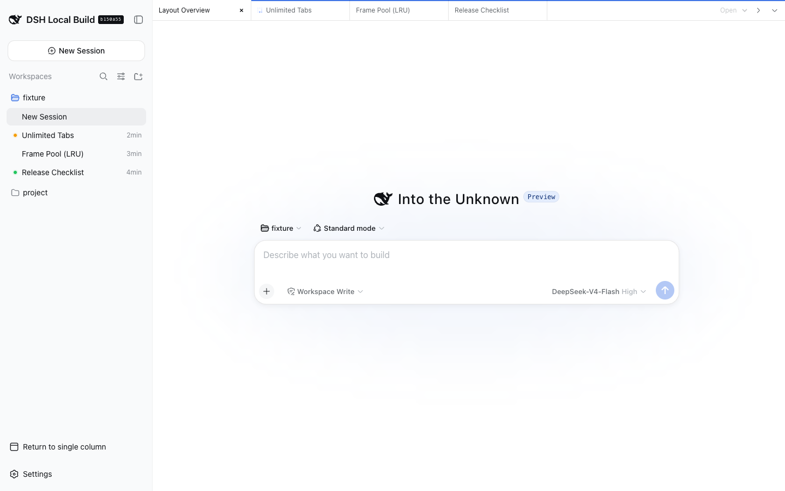
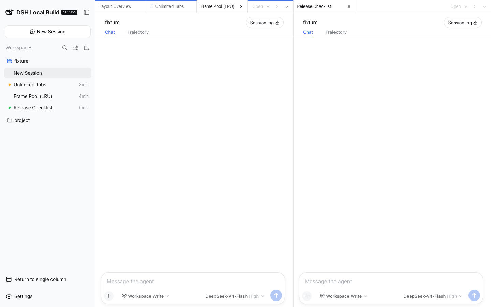
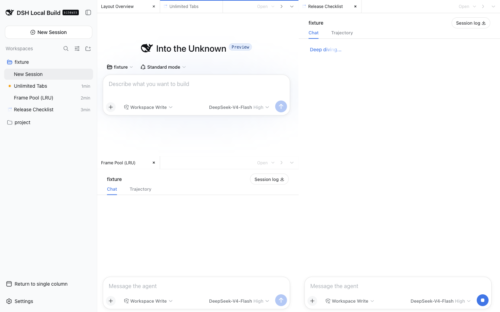

# @ai-eks/dsh-docking-layout

[English](README.md) | 中文

这是一个 DeepSeek Harness Web UI 插件，用编辑器式分组组织不限数量的对话 Tab。可以自由拆分；窗格过小时由用户关闭或移动 Tab。

## 截图



| 双窗格 | 三窗格 |
| --- | --- |
|  |  |

## 功能

- Tab 和分组数量不限，不设置固定的窗格尺寸门槛。
- 把 Tab 拖到另一分组可直接移动，拖到边缘可拆分；工具栏支持向右或向下拆分。
- 宽度不超过 760 像素时，一次显示一个全宽分组，并通过分组切换栏导航。
- 切回单栏模式或其他主面板时隐藏停靠窗格，返回后恢复分组。
- 关闭 Tab 只改变浏览器布局，不会删除对应的 DSH Session。关闭最后一个 Tab 会打开空白会话；DSH 选中已有空白会话时会复用它。

## 安装

从 npm 安装：

```sh
dsh plugin --profile web add @ai-eks/dsh-docking-layout@latest
```

从 Git 安装：

```sh
dsh plugin --profile web add github:ai-eks/dsh-docking-layout
```

从本地 checkout 安装：

```sh
git clone https://github.com/ai-eks/dsh-docking-layout.git
cd dsh-docking-layout
pnpm install
dsh plugin --profile web add .
```

卸载插件：

```sh
dsh plugin --profile web remove @ai-eks/dsh-docking-layout
```

在 DSH 侧栏底部启用 Docking Layout。通过分组菜单或 DSH 侧栏打开 Session，再拖动 Tab 或使用拆分按钮调整布局。

## 性能与限制

iframe 池会保留每个分组的活动 Tab，以及最近使用的 2 个非活动 Tab；被淘汰的 Tab 再次打开时会重新加载。共享预览另保留一个独立 iframe。分组越多，浏览器内存和 DSH Web 连接数越高。

整页共用一个右侧预览栏；切换会话或分组不会切换或重置已打开的文件。任意会话中的文件链接都在此处打开，收起后保留预览内容。文件浏览器初始使用首个会话的工作区；预览状态在当前页面内保留，刷新页面后重置。伴随插件仍跟随外层 DSH Session。已归档 Session 和子 Agent 路由使用原生对话视图；触屏布局使用拆分按钮和分组切换栏，不依赖 Tab 拖拽。

插件只在浏览器本地保存布局偏好，不复制 Session 日志、提示词、审批或文件；所有嵌入页面均为同源页面。插件不会增加模型可见的提示词、工具、消息或 Session 事件。

## 兼容性

要求 DeepSeek Harness `^0.1.5-rc.1` 和 Cordis `^4.0.2`。本版本使用 DSH 0.1.5 引入的主面板导航和布局接口。DSH 0.1.2 请使用插件 `0.1.2-rc.1`。

## 开发验证

```sh
pnpm install
pnpm typecheck
pnpm test
pnpm build
```
